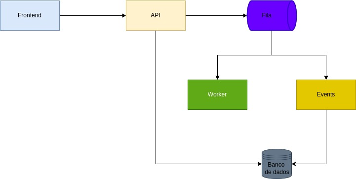

# Desafio DEV

## Fluxo de processamento

O projeto foi construído utilizando arquitetura de microserviços e event sourcing. Ele está dividido em 4 microserviços: O ```frontend```, que exibe as informações e envia os arquivos; A ```API```, que fornece ao frontend os dados salvos no banco e recebe o arquivo a ser processado; O ```worker``` que processa o arquivo recebido pela API; O ```events```, que é responsável por salvar os dados processados no banco de dados. Os serviços se comunicam por meio de API Rest e filas de messageria (Rabbitmq). O banco de dados utilizado para persistir as infomações foi o PostgreSQL.

Basicamente o ```frontend``` irá ler o arquivo do usuário e enviará para a ```API``` que receberá e vai persistir o arquivo no disco utilizando um volume compartilhado. Após isso, será enviado uma mensagem para fila de mensagens do worker (A fila foi criada usando o Rabbitmq) com o caminho do arquivo salvo no volume compartilhado.

O ```worker``` receberá a mensagem e iniciará o processamento do arquivo. Primeiramente, o arquivo é lido do volume compartilhado, depois suas linhas são separadas para serem parseadas individualmente. Depois da etapa de leitura, cada linha é parseada de acordo com as posições dos campos informados nos [requisitos do projeto](./README_BASE.md). Por fim, o ```worker``` enviará mensagens para a fila do ```envets``` com os dados parseados.

O ```events``` receberá as mensagens com os dados e irá salvar-los na tabela events do banco de dados. A tabela events possui triggers em que ao inserir novos dados, elas atualizarão a tabela correspondente aos dados. O uso da tabela events para manipular os dados do campo foi pensado para unificar as atualizações do banco de modo a prevenir falhas de concorrência, bem como manter registrado os eventos do banco facilitando o tracking de possíveis bugs do sistema.

O diagrama abaixo mostra a arquitetura do projeto explicada:


## Iniciando o projeto

### Dependências necessárias
Antes de executar o projeto é preciso certificar-se de ter algumas depências instaladas. Elas são: ```Python3``` (e o pip caso não esteja instalado), o ```Docker``` e o ```Docker Compose```.

### Criando tabelas no banco
Após certificar-se de ter todas dependências instaladas, é preciso popular o banco de dados com as tabelas que serão utilizadas. Para isso, basta executar na raíz do projeto o comando:

```shell
make migrate
```

OBS: Só é necessário executar esse comando na primeira vez que em for executar o projeto.

### Executando o projeto
Depois de instaladas as dependências e as tabelas sido criadas é possível iniciar o projeto. Para isso execute o seguinte comando:

```shell
make run
```

Após isso, basta aguardar até que todos os serviços sejam iniciados e acessar a seguinte url: [http://localhost:8081](http://localhost:8081).

## Executando testes unitários
Para executar os testes unitários é necessário ter as dependências instaladas e o bando de dados construído (já explicado em etapas anteriores). Após isso, basta executar o comando:

```shell
make test
```

## Acessando documentação da API
Para acessar a documetação da api, é preciso executar o projeto e acessar a seguinte url: [http://localhost:8081/api/docs/schema/swagger-ui/](http://localhost:8081/api/docs/schema/swagger-ui/)

## Exemplo de consumo da api

### Enviando arquivo
```python
import requests

with open("cnab.txt") as f:
    resp = requests.post(
        "http://localhost:8081/api/file/",
        files={
            "file": f
        }
    )
```

### Carregando operações por nome de loja

```python
import requests

resp = requests.get(
    "http://localhost:8081/api/cnab-documentation/?store_name=store_name"
)
```

### Carregando dados das lojas
```python
import requests

resp = requests.get(
    "http://localhost:8081/api/store/"
)
```

## Lista de comandos

```make migrate```: Inicia o bando de dados PostgreSQL e cria as tabelas necessárias.

```make run```: Inicia todos os serviços do projeto.

```make test```: Executa os testes unitários.
